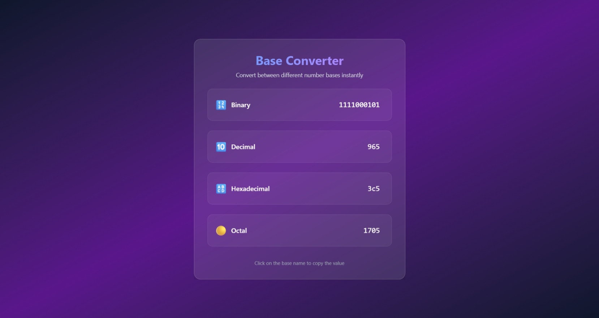

# Base Converter

Convert to decimal, hexadecimal, octal, and binary

## General

Use vanila typescript

- Frontend Library: Vue
- Bundler: Vite
- Formatter: Biome
- Git Hook: Husky
- Container: Docker, Devcontainer
- CI/CD: Github Actions
- Package Manager: NPM
- Language: Typescript

